# JanSunwai AI - AWS AI for Bharat Hackathon
## Slide-by-Slide Content

---

## SLIDE 1: Title Slide

**Team Name:** JanSunwai AI

**Problem Statement:** AI-Powered Civic Grievance Resolution Platform for India

**Team Leader Name:** [Your Name Here]

---

## SLIDE 2: Brief About the Idea

### JanSunwai AI — "Your Voice Matters. We Make It Heard."

JanSunwai AI is an end-to-end, AI-powered civic grievance resolution platform designed for Indian citizens. It transforms the broken complaint redressal system by combining **multimodal complaint filing** (web form + voice agent), **AI-driven classification & routing**, **automated escalation**, and **public transparency dashboards** — ensuring every citizen's voice reaches the right authority and gets resolved within SLA timelines.

**The Core Vision:**
- A citizen in rural India can **call and speak in Hindi** to file a complaint — no forms, no literacy barrier
- AI automatically **classifies** the issue (water, roads, electricity, sanitation, etc.), **scores severity**, **detects duplicates**, and **routes** it to the right municipal department
- A **5-level auto-escalation engine** ensures no complaint is ignored — escalating all the way to the Commissioner if SLA deadlines are breached
- **Public heatmap dashboards** show ward-level problem hotspots, creating civic pressure for resolution
- Citizens receive **AI-generated legal rights awareness** — empowering them with knowledge of applicable laws (RTI Act, Article 21, Municipal Acts)

**Scale of the Problem:**
- **2.8 Crore** pending civic grievances across India
- **45 days** average resolution time
- **67%** of citizens unaware of their legal rights
- **12+** government departments with zero cross-communication

---

## SLIDE 3: Solution Differentiation & USP

### How is JanSunwai AI different from existing solutions?

| Aspect | Existing Systems (CPGRAMS, 311, etc.) | JanSunwai AI |
|--------|----------------------------------------|--------------|
| Filing Method | Web forms only | **Voice Agent (Hindi) + Web Form + Multi-language** |
| Classification | Manual / keyword-based | **AI-powered (Gemini Vision + NLP)** with photo analysis |
| Routing | Manual department assignment | **Auto-routing** to exact department + ward officer |
| Escalation | None / manual follow-up | **5-level auto-escalation** with SLA tracking |
| Transparency | Opaque — no public data | **Public heatmaps + ward scorecards** |
| Legal Awareness | None | **AI-generated legal rights** per complaint category |
| Duplicate Detection | None | **Semantic + geographic clustering** into community issues |
| Accessibility | Requires literacy + internet | **Voice-first design** — works for low-literacy citizens |

### How does it solve the problem?

1. **Eliminates barriers** — Voice agent allows anyone to file a complaint by simply speaking
2. **Eliminates misrouting** — AI classifies and routes to the exact responsible department
3. **Eliminates negligence** — Auto-escalation ensures every complaint gets attention within SLA
4. **Creates accountability** — Public dashboards expose department performance at ward level
5. **Empowers citizens** — Legal rights summaries inform citizens of their entitlements

### USP (Unique Selling Proposition)

> **"The only platform that combines AI voice filing in Indian languages, automated severity-based escalation, and public ward-level accountability dashboards — making civic grievance resolution accessible, intelligent, and transparent."**

Key differentiators:
- **Voice-first accessibility** — Deepgram STT (Hindi) + Gemini LLM + ElevenLabs TTS
- **Composite severity scoring** — 5-factor algorithm (issue type 30% + affected population 25% + vulnerability 20% + time sensitivity 15% + recurrence 10%)
- **Community issue clustering** — Links geographically similar complaints to surface systemic problems
- **RTI integration** — Auto-drafts Right to Information applications for unresolved complaints

---

## SLIDE 4: List of Features

### Core Features

**1. Multi-Modal Complaint Filing**
- 4-step web wizard (Describe > Location > Details > Review)
- Voice agent — speak in Hindi/English to file complaints hands-free
- 12 grievance categories with AI auto-detection
- Photo upload with Gemini Vision analysis
- Geolocation via Google Maps API
- Support for 10+ Indian languages

**2. AI-Powered Intelligence Engine**
- Gemini-based complaint classification (category, sub-category, severity)
- Image analysis for visual evidence (potholes, leaks, debris)
- Semantic duplicate detection + geographic clustering
- AI-generated structured descriptions from unstructured citizen input

**3. Smart Routing & Severity Scoring**
- Auto-routing to responsible department + ward officer
- Composite severity score (0-100) based on 5 weighted factors
- Priority flags for vulnerable citizens (elderly, disabled, BPL, pregnant)
- Ward-level granularity using PostGIS geocoding

**4. 5-Level Auto-Escalation Engine**
- Level 1 (0-48h): Ward Officer
- Level 2 (48-96h): Department Head (auto-escalate if no acknowledgment)
- Level 3 (96h-7d): Commissioner
- Level 4 (7-14d): Commissioner + Public Flag + RTI Offer
- Level 5 (14d+): Systemic Failure Tag

**5. Public Transparency Dashboard**
- Ward-level heatmaps showing problem hotspots
- Category breakdown, status filters, live stats
- Ward scorecards with department performance metrics
- Trend analysis over time

**6. Admin / Officer Portal**
- Role-based dashboards (Ward Officer, Dept Head, Commissioner)
- Queue management with filters + severity sort
- Complete grievance timeline (filed > acknowledged > resolved)
- Manual escalation with reason logging
- Department-level statistics and SLA tracking

**7. Legal Rights Awareness**
- AI-generated legal summaries per complaint category
- References: Article 21, RTI Act 2005, Municipal Acts
- SLA timelines from applicable laws
- Auto-drafted RTI applications for negligent departments

**8. Citizen Verification & Feedback**
- SMS/WhatsApp verification tokens
- Resolution satisfaction scoring (1-5 stars)
- Reopen capability if unsatisfied

### Feature Visual Overview (Mermaid)

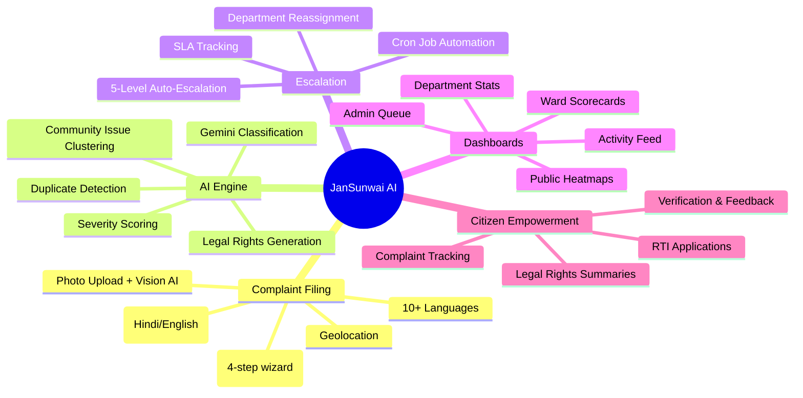

---

## SLIDE 5: Process Flow Diagram

### Grievance Lifecycle — End-to-End Flow

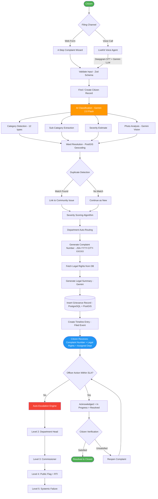

### Use Case Diagram

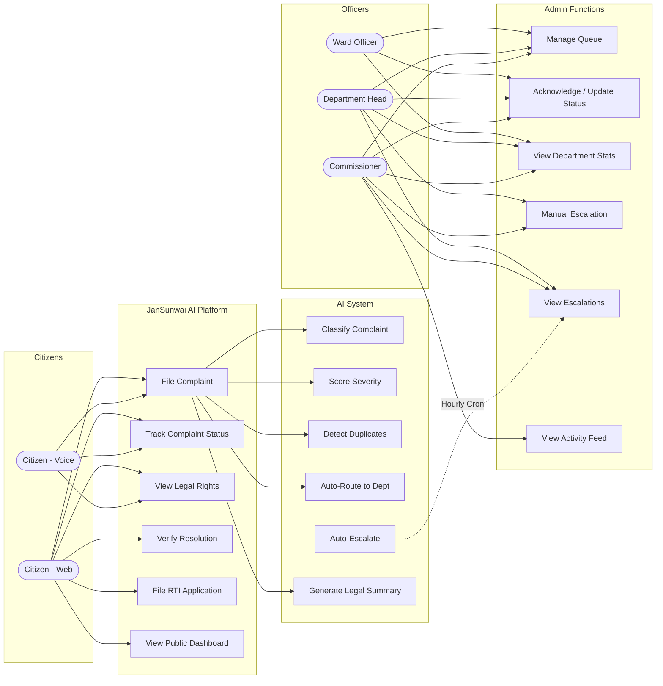

---

## SLIDE 6: Wireframes / Mock Diagrams

### Screen Flow Map (Mermaid)

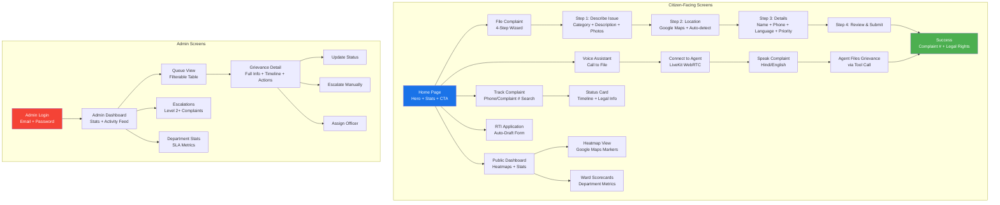

### Key Screen Descriptions

| Screen | Key Elements |
|--------|-------------|
| **Home Page** | Hero section, live stats counter (2.8 Cr pending), 3 CTA buttons (File, Track, Dashboard), feature cards |
| **File Complaint** | Stepper UI, category grid (12 icons), photo dropzone, Google Maps picker, language selector, vulnerability checkboxes |
| **Voice Assistant** | Large mic button, connection status, live transcript, call timer, agent avatar |
| **Public Dashboard** | Google Maps heatmap, filter chips (status/category), stats bar, ward list with scores |
| **Track Complaint** | Search bar (phone/complaint#), status card with timeline, legal rights accordion |
| **Admin Queue** | Data table with filters, severity badges, SLA deadline countdown, pagination |
| **Grievance Detail** | Split layout — left: complaint info + photos, right: timeline + actions |

---

## SLIDE 7: Architecture Diagram

### System Architecture

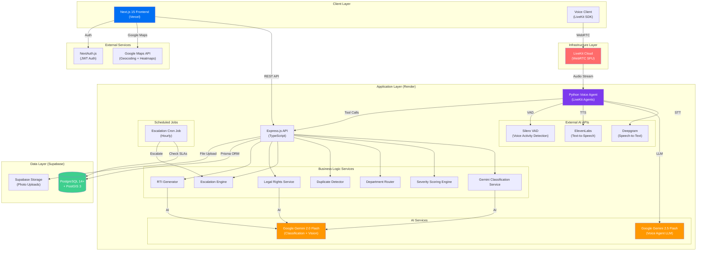

### Data Flow Architecture

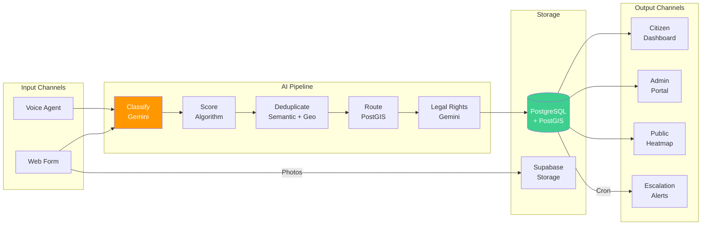

---

## SLIDE 8: Technologies Used

### Technology Stack

### Full Technology Breakdown

| Layer | Technology | Purpose |
|-------|-----------|---------|
| **Frontend** | Next.js 15 (App Router) | SSR, routing, React Server Components |
| | React 19 | UI component library |
| | Tailwind CSS 4 | Utility-first styling |
| | TypeScript | Type safety |
| | LiveKit Client SDK | WebRTC voice connection |
| | Google Maps JS API | Geolocation, heatmaps, markers |
| | NextAuth.js | Admin authentication (JWT) |
| **Backend** | Express.js | REST API server |
| | Prisma ORM | Type-safe database access |
| | PostgreSQL 14+ | Primary database |
| | PostGIS 3 | Geographic queries (ward resolution, proximity) |
| | Zod | Input validation schemas |
| | Node-Cron | Scheduled escalation jobs |
| | Helmet + CORS | Security middleware |
| | bcryptjs | Password hashing |
| **AI Engine** | Google Gemini 2.0 Flash | Complaint classification, legal summary generation |
| | Gemini Vision | Photo analysis (damage, infrastructure issues) |
| | Custom Algorithm | 5-factor severity scoring (0-100) |
| **Voice Agent** | LiveKit Agents (Python) | Real-time voice processing framework |
| | Google Gemini 2.5 Flash | Conversational LLM with tool calling |
| | Deepgram (nova-2-general) | Speech-to-Text (Hindi/English) |
| | ElevenLabs (turbo v2.5) | Text-to-Speech (natural Hindi voice) |
| | Silero VAD | Voice activity detection |
| **Database** | Supabase (PostgreSQL) | Managed database hosting |
| | Supabase Storage | Photo/document storage |
| **Deployment** | Vercel | Frontend hosting (edge network) |
| | Render | Backend API + Voice Agent hosting |
| | LiveKit Cloud | WebRTC SFU (media routing) |
| **Monorepo** | npm Workspaces | Shared types & validators across apps |

### AWS Services Mapping

| Current Service | AWS Equivalent | Purpose |
|----------------|---------------|---------|
| Google Gemini | **Amazon Bedrock** (Claude/Titan) | AI classification, legal summary, vision |
| Deepgram STT | **Amazon Transcribe** | Speech-to-text (Hindi) |
| ElevenLabs TTS | **Amazon Polly** | Text-to-speech (Hindi) |
| Supabase PostgreSQL | **Amazon RDS** (PostgreSQL + PostGIS) | Primary database |
| Supabase Storage | **Amazon S3** | Photo/document storage |
| Vercel | **AWS Amplify** | Frontend hosting |
| Render | **AWS App Runner / ECS** | Backend API hosting |
| LiveKit Cloud | **Amazon Chime SDK** | WebRTC real-time voice |
| Google Maps | **Amazon Location Service** | Geocoding, maps, heatmaps |
| Node-Cron | **Amazon EventBridge** | Scheduled escalation jobs |
| NextAuth JWT | **Amazon Cognito** | Authentication & authorization |

---

## SLIDE 9: Estimated Implementation Cost

### Monthly Cost Estimate (AWS Infrastructure)

| AWS Service | Usage Estimate | Monthly Cost (USD) |
|------------|---------------|-------------------|
| **Amazon Bedrock** (Claude/Titan) | ~50K classifications/month | $150 - $300 |
| **Amazon Transcribe** (Hindi STT) | ~500 hours audio/month | $120 |
| **Amazon Polly** (Hindi TTS) | ~2M characters/month | $8 |
| **Amazon RDS** (PostgreSQL + PostGIS) | db.t3.medium, 100GB | $70 |
| **Amazon S3** (Photo Storage) | 50GB + transfers | $5 |
| **AWS Amplify** (Frontend) | Standard hosting | $15 |
| **AWS App Runner** (Backend API) | 2 vCPU, 4GB RAM | $50 |
| **Amazon Chime SDK** (Voice) | ~10K minutes/month | $30 |
| **Amazon Location Service** | ~100K geocoding requests | $50 |
| **Amazon EventBridge** | Hourly cron triggers | $1 |
| **Amazon Cognito** | ~1K admin users | Free tier |
| **Amazon CloudWatch** | Monitoring + logs | $10 |
| | | |
| **Total Estimated** | | **$509 - $659/month** |

### Scaling Projections

| Scale | Users/Month | Complaints/Month | Est. Cost/Month |
|-------|------------|-------------------|----------------|
| **Pilot** (1 city) | 10K | 5K | ~$500 |
| **Regional** (1 state) | 100K | 50K | ~$2,500 |
| **National** | 1M+ | 500K+ | ~$15,000 |

### Cost Optimization Strategies
- **Amazon Bedrock** batch inference for non-real-time classification
- **S3 Intelligent Tiering** for photo storage lifecycle
- **RDS Reserved Instances** for 40% savings on database
- **CloudFront CDN** for frontend caching
- **Lambda** for escalation jobs (pay-per-invocation vs always-on)

---

## SLIDE 10: Additional Information

### Impact Metrics (Projected)

| Metric | Current State | With JanSunwai AI |
|--------|--------------|-------------------|
| Avg. Resolution Time | 45 days | **7-14 days** (SLA-enforced) |
| Citizen Awareness of Rights | 67% unaware | **90%+ informed** (AI-generated) |
| Misrouted Complaints | ~40% | **<5%** (AI classification) |
| Duplicate Complaints | ~30% | **<10%** (semantic dedup) |
| Department Accountability | Near zero | **100% tracked** (public dashboards) |
| Accessibility (low-literacy) | Excluded | **Fully included** (voice agent) |

### Scalability & Future Roadmap

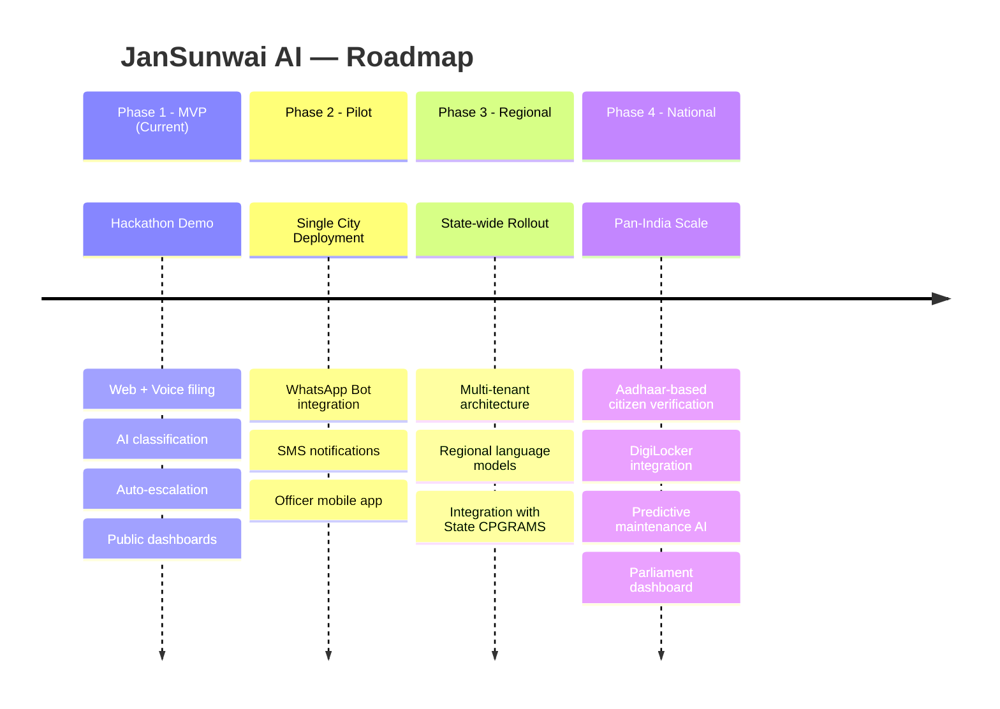

### Alignment with Government Initiatives
- **Digital India** — AI-first citizen services
- **CPGRAMS** — Centralized grievance system integration
- **Smart Cities Mission** — Data-driven municipal governance
- **RTI Act 2005** — Transparency & citizen empowerment
- **Article 21** — Right to clean environment & safe infrastructure

### Team Strengths
- Full-stack development (Next.js, Express, Python)
- AI/ML integration (Gemini, voice agents)
- Civic technology domain knowledge
- AWS cloud architecture experience

---

## SLIDE 11: Thank You / Closing

### JanSunwai AI

**"Your Voice Matters. We Make It Heard."**

An AI-powered platform transforming how 1.4 billion Indians resolve civic grievances — making government accountable, citizens empowered, and cities smarter.

**Built with:** Next.js | Express | Gemini AI | LiveKit | PostGIS | AWS-Ready

---

# APPENDIX: All Mermaid Diagrams (Copy-Paste Ready)

## A1. Voice Agent Architecture

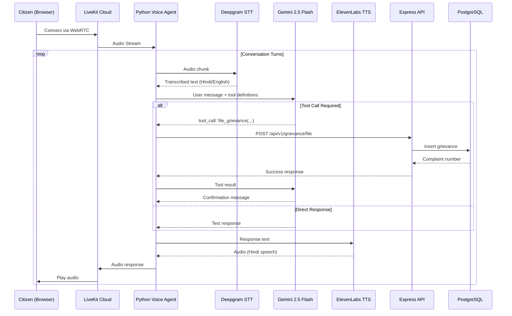

## A2. Escalation Engine Flow

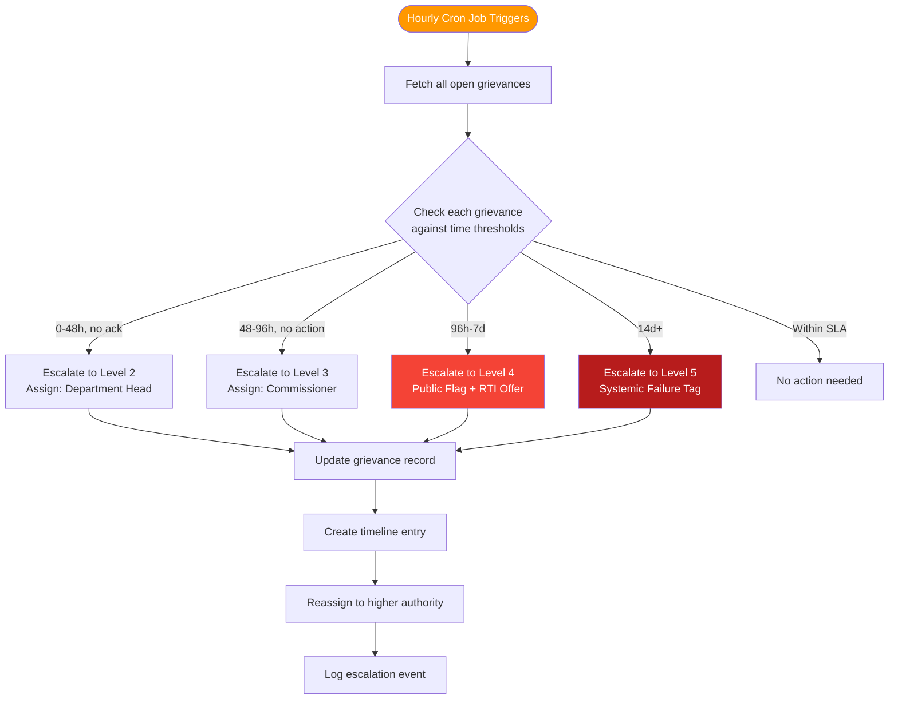

## A3. Severity Scoring Breakdown

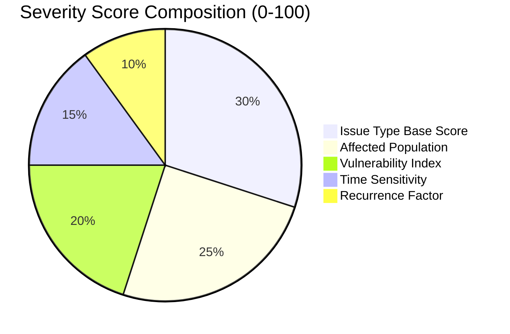

## A4. Database Entity Relationship

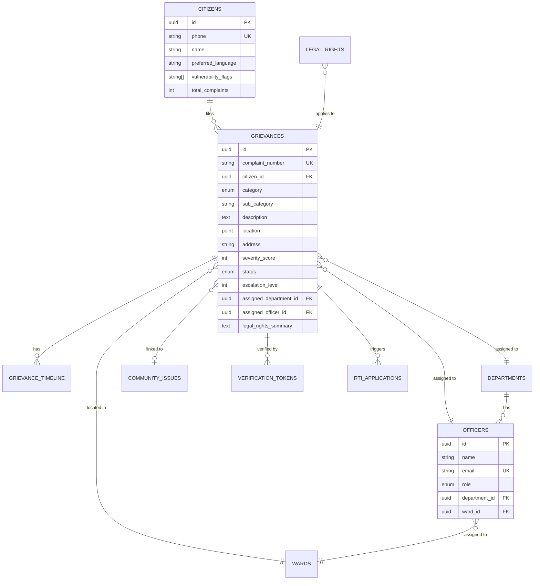

## A5. Deployment Architecture

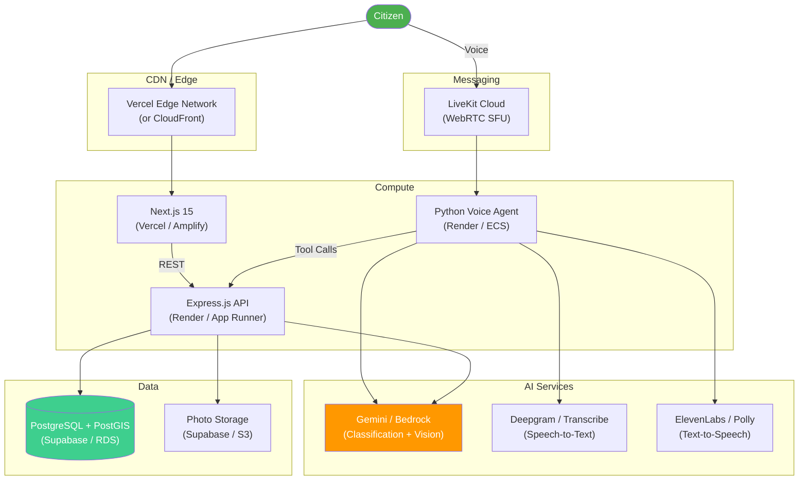
